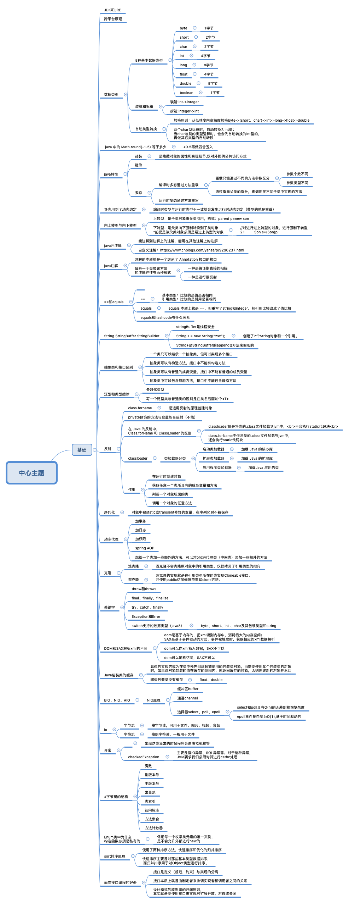
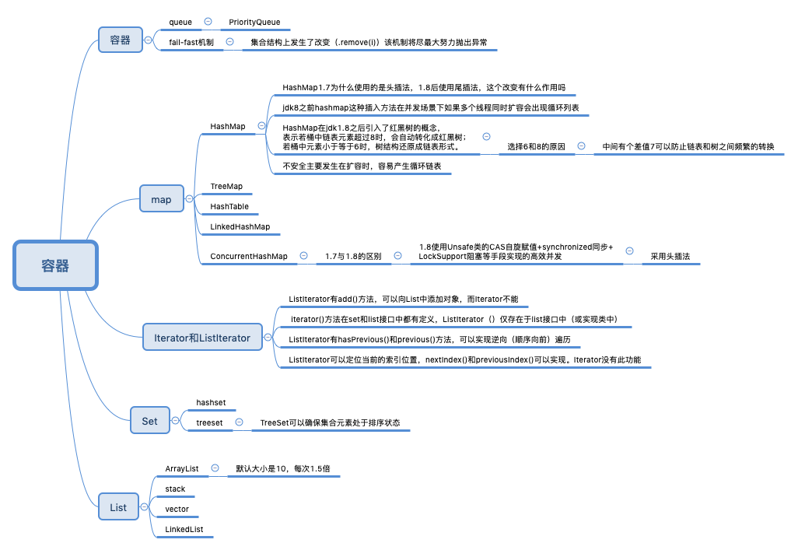
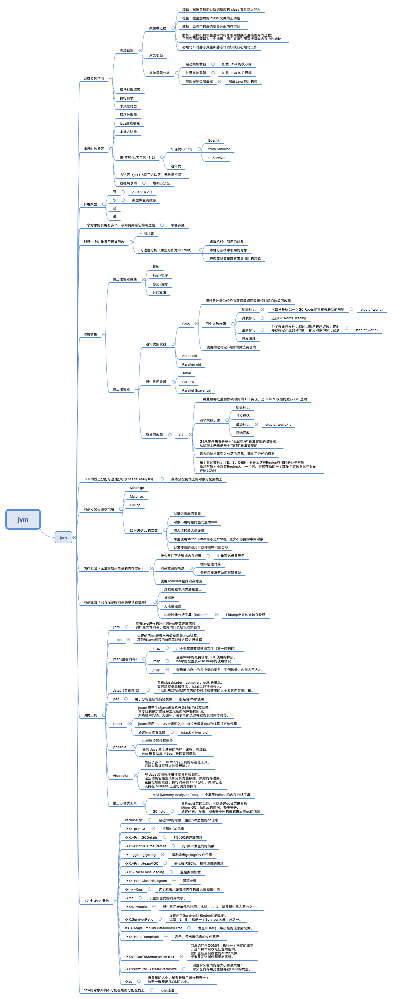
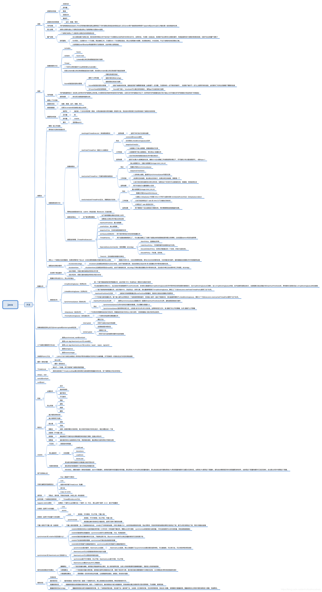
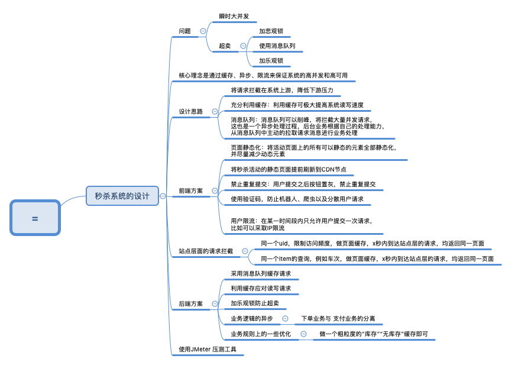
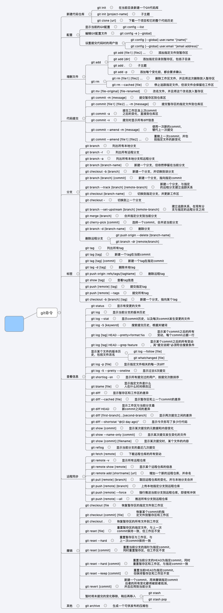

hello, 大家好，我是Java程序哥，一个来自魔都的程序员，小马哥每个月会付我薪水！！！

微信搜【VeryJava】关注我，关注后回复 【资料】有我准备的大厂面经、简历模板和免费电子书， GitHub https://github.com/VeryJava 整理了很多我的文档，欢迎Star和完善，今天最大的努力，是明天最低的要求，加油。

这里我为你准备了Java后端面试，需要的基础知识，这里有脑图，目前正在逐渐开放。

